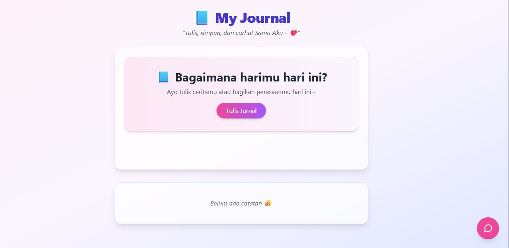

# 📘 My Journal App

> *"Tulis, simpan, dan curhat bersamaku~ ❤️"*

Aplikasi jurnal harian sederhana dengan fitur CRUD dan AI Companion (CurhatAI) yang ramah dan empatik. Dibangun menggunakan teknologi modern agar pengguna merasa nyaman menulis cerita mereka.
Aplikasi ini di kembangkan dengan bantuan dari GraniteModels AI juga.

---

## 💡 Fitur Utama

- ✍️ **Tambah, Edit, Hapus entri jurnal**
- 🧠 **CurhatAI** – Teman virtual yang selalu siap dengarkan kamu
- 📝 UI lucu dan friendly dengan warna pastel
- 📱 Responsif di semua ukuran layar
- 🗂️ Data disimpan secara lokal menggunakan JSON (backend sederhana)
- 🚀 Cepat dan mudah dikembangkan

---

## 🔧 Teknologi yang Digunakan

| Bagian | Teknologi |
|--------|-----------|
| Frontend | React + Tailwind CSS |
| Backend | Express.js |
| Database | Local JSON file |
| AI Chat | OpenRouter API (`qwen/qwen3-8b`) |
| Styling | TailwindCSS + Glassmorphism |

---

## 🛠 Cara Menjalankan Proyek

### 1. Clone Repositori

```bash
git clone https://github.com/Rizki-Hibatuloh/SiniCurhat.git
cd repository

### 2.Jalankan Backend
cd backend
npm install
node app.js

### 3. Jalankan Frontend

cd frontend
npm install
npm run dev

### 4. Struktur FOlder 
.
├── backend/
│   ├── app.js
│   ├── routes/
│   │   └── journalRoutes.js
│   ├── controller/
│   │   └── JournalController.js
│   ├── chatAI/
│   │   └── curhatAI.js
│   └── data/
│       └── journals.json
│
├── frontend/
│   ├── public/
│   ├── src/
│   │   ├── components/
│   │   │   ├── EntryForm.jsx
│   │   │   ├── EntryList.jsx
│   │   │   └── CurhatAI.jsx
│   │   ├── App.jsx
│   │   └── main.jsx
│   │
│   └── index.html
│
├── .env.example        # Contoh env file
├── package.json
└── README.md

### 5. 🤖 CurhatAI
CurhatAI adalah fitur chatbot berbasis AI yang dirancang untuk memberikan dukungan emosional kepada pengguna.
Gunakan tombol floating di pojok kanan bawah untuk mulai curhat.

            ### APLIKASINYA 



            ### 

            📌 Lisensi
MIT License — bebas digunakan/dikembangkan ulang!

👨‍💻 Dibuat oleh
Rizki Hibatuloh
Instagram: [@HibatulohRizki]
GitHub: [github.com/Rizki-Hibatuloh]

🙌 Terima Kasih
Thanks for using this journal app!
Kalau kamu suka atau pakai ini untuk tugas akhir, jangan lupa kasih star ⭐ di GitHub ya~

📦 Deployment
Kamu bisa deploy frontend ke:

Vercel
Netlify
GitHub Pages
Dan backend ke:

Railway
Render
Heroku
